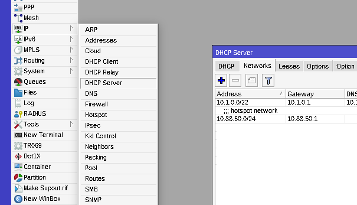
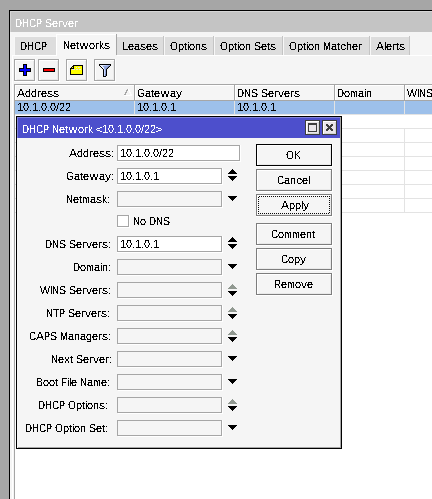

This guide explains the basic way to add a DNS server for your local LAN on a Mikrotik Routerboard. Following the first method below will have you adding your Pi-hole as a DNS server for all devices on your LAN. 
  
!!! note
    IPv6 is a bit more difficult so we've included a link to the discussions on it. IPv4 is detailed here.
  
!!! warning
    Make sure your Pi-hole server is not using your router as it's upstream DNS server. Use an external DNS server or your own resolver.  
  
## Grab your IPv4 and IPv6 address from your Raspi

SSH into your Raspi. A quick `ifconfig eth0` (substituting `eth0` for the applicable network interface) will get you the address information:

```
eth0: flags=4163<UP,BROADCAST,RUNNING,MULTICAST>  mtu 1500
        inet 192.168.0.9  netmask 255.255.255.0  broadcast 192.168.0.255
        inet6 2001:470:5:3::8ed  prefixlen 128  scopeid 0x0<global>
        inet6 2001:470:5:3:8d70:e92e:7030:6eef  prefixlen 64  scopeid 0x0<global>
        inet6 fe80::337f:710d:6781:4c85  prefixlen 64  scopeid 0x20<link>
        ether dc:a6:32:0e:31:2d  txqueuelen 1000  (Ethernet)
        RX packets 1297459  bytes 1279521260 (1.1 GiB)
        RX errors 0  dropped 0  overruns 0  frame 0
        TX packets 2315988  bytes 2766370095 (2.5 GiB)
        TX errors 0  dropped 0 overruns 0  carrier 0  collisions 0
```

Take note of the `inet` address, and the `inet6` address which starts with `fe` (denotes a local link or LAN address). Those are the IPs which you'll use as your DNS servers in the USG. For this example, we'll be using the `192.168.0.9` and `fe80::337f:710d:6781:4c85` IPs for the following directions.

## IPv4  

Choosing this option will have DNS queries taking the following path:

```
(Clients) -> Pi-hole -> Upstream DNS Server
```

Go to **IP**, **DHCP Server**, then click on the **Networks** tab.

  
```
mikrotik script:
/ip dhcp-server network print
```

Double click *(open)* the network you want to configure:



Enter the IP address of the pi-hole server into the DNS Servers setting.  

```
mikrotik script:
/ip dhcp-server network set dns-server={RASP PI IP} numbers={Number from the print command above}
```

## IPv6  

See [https://forum.mikrotik.com/viewtopic.php?t=177751](https://forum.mikrotik.com/viewtopic.php?t=177751)